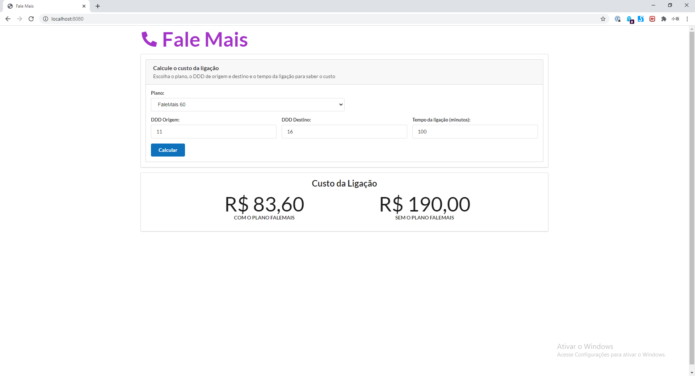

Fale Mais
=========

## Como executar

Foi disponibilizado o jar no diretório distribution:

```
java -jar distribution/falemais-1.0.0-SNAPSHOT.jar
```

Ou usando o Maven para rodar os testes automatizados e gerar o arquivo jar:

```
mvn package

java -jar target/falemais-1.0.0-SNAPSHOT.jar
```

Ou o projeto pode ser importado como um projeto Maven numa IDE como IntelliJ ou Eclipse e ser executado o main da classe /src/main/java/com/telzir/falemais/FaleMaisApplication.java. Necessário o plugin do Lombok.

Com o navegador, acessar: http://localhost:8080



Deploy feito no Heroku para visualização também:

https://sheltered-hamlet-64098.herokuapp.com/

## Backend

### Foi utilizado

- Java 11
- Spring Boot 2.3.1
- Lombok
- Banco de dados H2 em memória
- Flyway para alterações de banco
- Maven

### Endpoints

Para testes no Postman, o arquivo FaleMais.postman_collection.json está disponível na raíz do projeto.

#### Cálculo da ligação

GET http://localhost:8080/v1/phone-call/cost

Query parameters:

- **sourceDDD**: DDD de origem
- **destinationDDD**: DDD de destino
- **time**: Tempo da ligação em minutos
- **planId**: Id do plano escolhido

Status:

- **200**: cálculo efetuado com sucesso
- **404**: caso o plano ou o custo não seja encontrado

Exemplo:

GET http://localhost:8080/v1/phone-call/cost?sourceDDD=011&destinationDDD=016&time=20&planId=1

Resposta:
```javascript
{
    "costWithPlan": 0,
    "costWithoutPlan": 38.00
}
```

#### Listagem dos planos

GET http://localhost:8080/v1/phone-plans

Exemplo:

GET http://localhost:8080/v1/phone-plans

Resposta:
```javascript
[
    {
        "id": 1,
        "name": "FaleMais 30",
        "minutes": 30.0
    },
    {
        "id": 2,
        "name": "FaleMais 60",
        "minutes": 60.0
    },
    {
        "id": 3,
        "name": "FaleMais 120",
        "minutes": 120.0
    }
]
```

## Frontend

Foi utilizado:

- React
- semantic-ui
- Node.js
- create-react-app

Para alterações no frontend (esses passos não são necessários para rodar o projeto, pois os arquivos de build do React já foram gerados):

```
Dentro da pasta frontend

Roda o projeto do frontend em http://localhost:3000: 
npm start

Faz o build do frontend copiando resultado na pasta de arquivos static do Spring Boot:
npm run build
```

## Estrutura do projeto

Para simplificar, o backend e frontend foram feitos no mesmo projeto.

Foi utilizado a estrutura padrão de diretório do Maven e Spring Boot.

Arquivos java do projeto (controllers, services, repositories, models, etc):
- src/main/java

Arquivos de configuração e templates:
- src/main/resources/db/migration - arquivos sql com estrutura do banco e os dados de custos e planos
- src/main/resources/static - arquivos gerados no build do React

Testes:
- src/test/java

Frontend com projeto React:

- frontend
- frontend/src/components - Componentes React e seus estilos
- frontend/src/util - Códigos auxiliares

